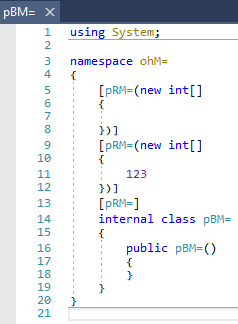
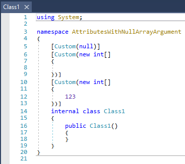

# Attributes with null array argument

.NET is internally crashing on retrieving the custom attributes of for example a type, when an attribute accepts an array and the value for this argument is null.

The decompilation itself doesn't look to bad though:  


And this is the original one:  


The code generates the following exception:

```
Unhandled Exception: System.Reflection.CustomAttributeFormatException: Binary format of the specified custom attribute was invalid.
   at System.Reflection.CustomAttribute._CreateCaObject(RuntimeModule pModule, IRuntimeMethodInfo pCtor, Byte** ppBlob, Byte* pEndBlob, Int32* pcNamedArgs)
   at System.Reflection.CustomAttribute.CreateCaObject(RuntimeModule module, IRuntimeMethodInfo ctor, IntPtr& blob, IntPtr blobEnd, Int32& namedArgs)
   at System.Reflection.CustomAttribute.GetCustomAttributes(RuntimeModule decoratedModule, Int32 decoratedMetadataToken, Int32 pcaCount, RuntimeType attributeFilterType, Boolean mustBeInheritable, IList derivedAttributes, Boolean isDecoratedTargetSecurityTransparent)
   at System.Reflection.CustomAttribute.GetCustomAttributes(RuntimeType type, RuntimeType caType, Boolean inherit)
   at System.RuntimeType.GetCustomAttributes(Boolean inherit)
   at ohM=.oRM=.oxM=() in [...]\Agile.net-Bugs\AttributesWithNullArrayArgument\src\Program.cs:line 15
```