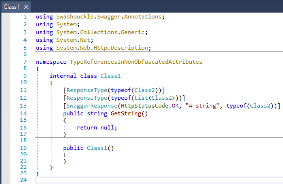
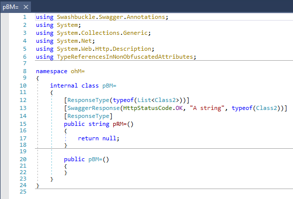
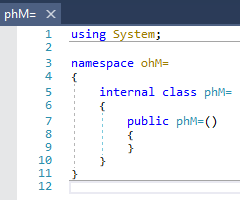

# Type references in non obfuscated attributes

Types that gets obfuscated and are used in attributes are not always changed in the attributes.

For this check the original decompilation:  

And the obfuscated one:  

And here is Class2 obfuscated (it's an empty class):  

As you can see "Class2" was obfuscated, but the references in the attributes were not always changed.  
If you check the original code/obfuscation, you will notice, that the references in the second and third attribute was not changed.